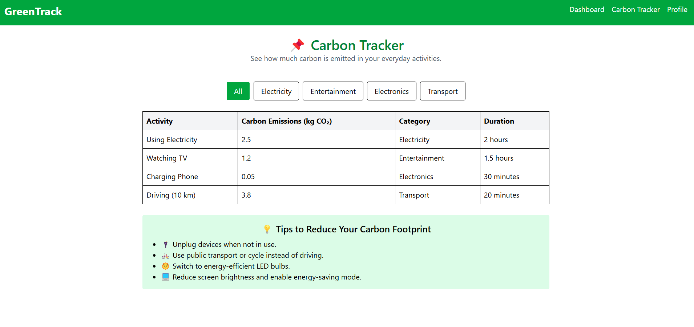
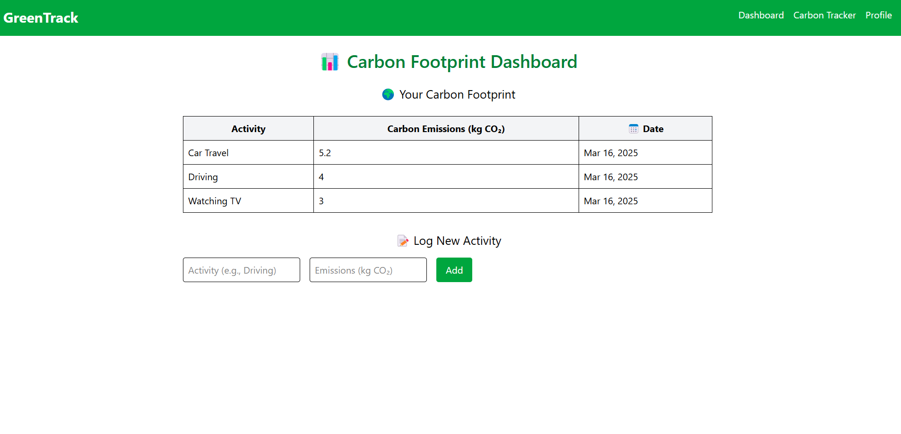
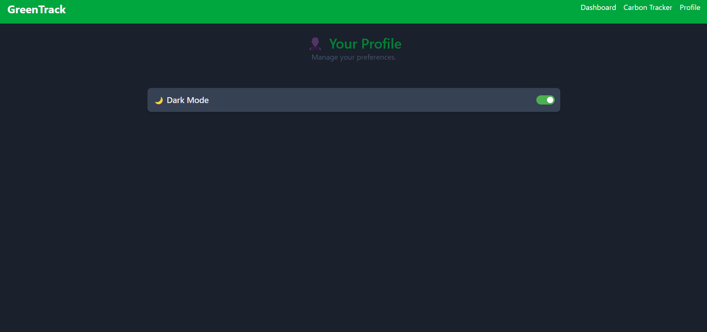

## **🌱 GreenTrack - Carbon Footprint Tracker**
GreenTrack is a full-stack web application designed to help users track and reduce their carbon footprint based on daily activities. The app provides insights into carbon emissions, suggests eco-friendly alternatives, and encourages sustainability.

### 🚀 Tech Stack
- **Frontend:**
1. Angular – Component-based UI
2. Tailwind CSS – Responsive and modern styling
- **Backend:**
1. Node.js & Express.js – RESTful API
2. MongoDB & Mongoose – Database for storing carbon data
- **Other Technologies:**
1. RxJS – Reactive programming in Angular
2. CORS & Body-parser – Middleware for API handling

### 📌 Features
- ✅ Track daily carbon emissions 📊
- ✅ Light & dark theme support 🌗

### 📷 Preview

   
  
   

---
